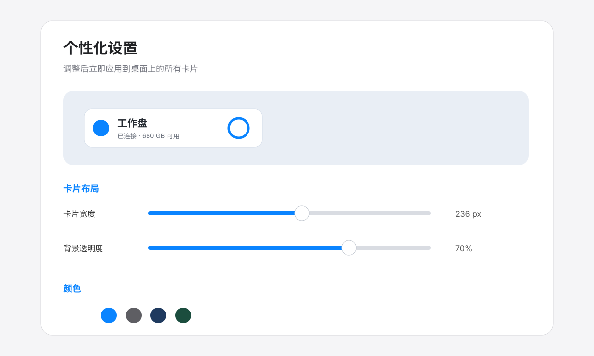
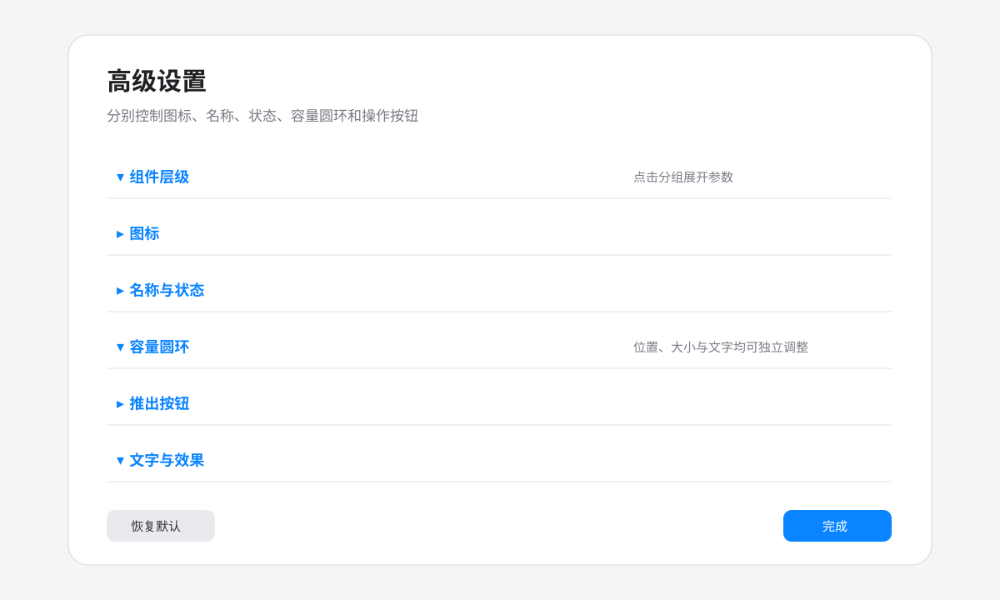

# DiskWidget

一个原生 Swift/AppKit macOS 桌面磁盘小组件。它把外置硬盘和 U 盘显示为桌面卡片，支持双击打开、拖放复制文件、安全推出、重新连接、自动检测新设备和统一布局调整。

## 功能

- 自动显示当前已挂载的外置硬盘和 U 盘，不在项目中保存或展示特定用户的卷名、容量或路径。
- 显示已用空间比例、可用容量和连接状态。
- 双击卡片在 Finder 中打开卷；右键可打开统一组件设置。
- 点击推出按钮安全卸载/推出；推出后可重新连接或移除卡片。
- 将文件或文件夹拖到卡片即可复制到卷，重名项目会自动编号，不覆盖原文件。
- 监听卷挂载/卸载通知，并以轮询作为兜底。
- 卡片位置、顺序、宽度、透明度、颜色和内部元素布局均可调整。

## 构建

要求 macOS 13 或更高版本、Xcode Command Line Tools 和 Swift 编译器。

```sh
./build.sh
open ./DiskWidget.app
```

也可以直接运行：

```sh
swiftc DiskWidget.swift -o DiskWidget.app/Contents/MacOS/DiskWidget -framework AppKit
```

将 `DiskWidget.app` 拖到“应用程序”后，可在系统设置的“登录项”中加入它以实现开机启动。

## 使用说明

1. 启动应用后，当前已挂载的外置卷会显示在桌面。
2. 拖动卡片可调整位置；普通拖动移动整组，按住 Option 可调整单张卡片顺序。
3. 双击卡片打开 Finder；点击容量圆环可查看更完整的容量提示。
4. 右键卡片打开菜单：可以打开统一组件设置、调整颜色与透明度、整理卡片、重新连接或移除卡片。
5. 将文件或文件夹拖到已连接卡片上即可复制到对应卷，应用不会覆盖同名项目。
6. 点击推出图标安全移除设备；设备重新插入后会自动恢复，或在卡片菜单中手动选择“重新连接”。

## 界面预览

以下图片使用通用示例名称和示例数据，不包含任何用户硬盘信息。

### 小组件主界面


### 个性化设置



### 高级设置



## 权限与隐私

应用不联网、不收集数据、不写入账号或凭据。它只读取本机卷信息，并将布局、卷 UUID 和卡片顺序写入当前用户的 `UserDefaults`。

安全推出、挂载和查询使用系统自带的 `/usr/sbin/diskutil`，参数由应用根据当前卷标识生成，不执行用户输入的 shell 字符串。拖放复制仅在用户主动拖入后发生，目标是当前卡片对应的卷。

“显示简介”功能通过 macOS 自带 `osascript` 请求 Finder 打开原生信息窗口，因此首次使用时 macOS 可能要求在“系统设置 → 隐私与安全性 → 自动化”中允许 DiskWidget 控制 Finder。应用不会读取或上传 Finder 内容。

完整审查记录见 [SECURITY.md](SECURITY.md)。

## 项目结构

- `DiskWidget.swift`：当前发布源码（基于无改名版）。
- `DiskWidget.app/`：本机已构建的应用包。
- `build.sh`：可复现构建脚本。

## Release

Release 包为 Apple Silicon macOS 构建，下载后将 `DiskWidget.app` 拖入“应用程序”，再到系统设置的“登录项”中加入它即可开机启动。源码和构建脚本仍然包含在仓库中。

## 许可证

暂未指定开源许可证。若要允许他人修改、分发或商用，请在发布前补充 LICENSE 文件。
